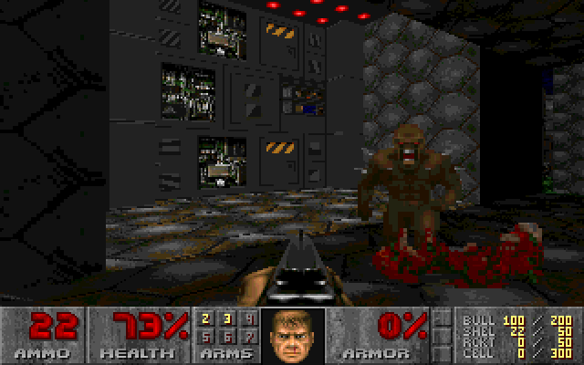
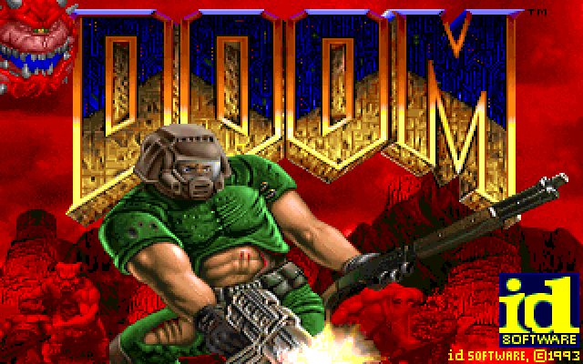
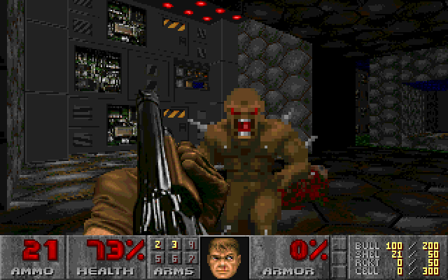
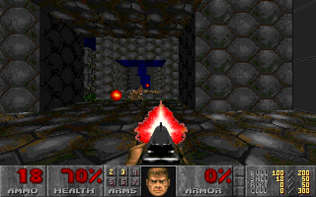
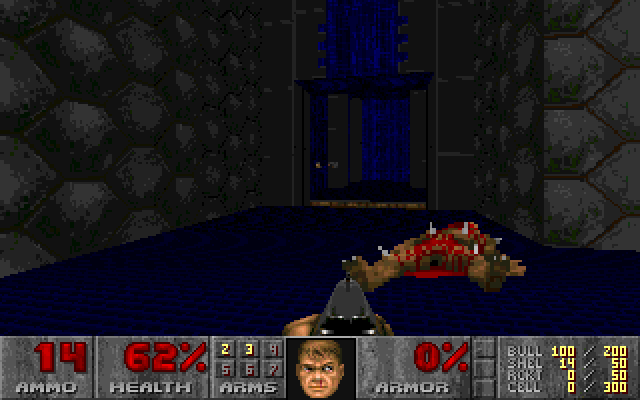
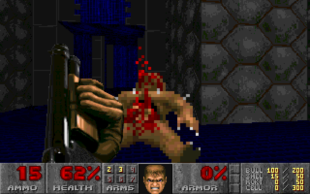

# NeXTDoom — Static Recompilation



Static recompilation of **NeXTDoom 1.2** — id Software's Doom as it shipped
for NeXTSTEP 3.3, the platform Doom was written on — from the i386 slice of
its fat `Doom.app/Doom` binary to native C. Every function in the game is
lifted to C and compiled into a new program; the NeXTSTEP it expects
(libsys, the Objective-C runtime, the slice of AppKit it touches) is a host
runtime on SDL2. No emulator.

Built on the [pcrecomp](https://github.com/sp00nznet/pcrecomp) toolchain:
its Mach-O front end
([`tools/macho`](https://github.com/sp00nznet/pcrecomp/tree/main/tools/macho)) and
NeXTSTEP host runtime
([`runtime/nextstep`](https://github.com/sp00nznet/pcrecomp/tree/main/runtime/nextstep)),
both on pcrecomp's `main` since
[#25](https://github.com/sp00nznet/pcrecomp/pull/25).

**Generated source is not distributed.** You supply your own NeXTSTEP 3.3
install; the lifter runs on your machine and writes the C into a gitignored
folder.

## Status

**v0.1 — it boots and plays the attract demo.**

crt0, `main`, the nib, `appDidInit:` and D_DoomMain all run as recompiled
code: the title screen comes up and the demos play — the 3D renderer
(including the two hand-written assembly column/span drawers), sprites,
status bar and palette effects. Keyboard is wired through `VGAView
keyDown:/keyUp:` but not yet play-tested. Everything on screen below is the
game's own code, recompiled.

| | |
|---|---|
|  |  |
| Title screen | Shotgun versus imp, demo 1 |
|  |  |
| A fireball coming down the corridor | The blue-floored room |



## Build

Clone [pcrecomp](https://github.com/sp00nznet/pcrecomp) next to this repo
(`../pcrecomp`; elsewhere, set `PCRECOMP` for the Python scripts and pass
`-DPCRECOMP=<path>` to CMake).

`original/` needs `Doom.app/` and `shlib/` (from `/usr/shlib`) from a
NeXTSTEP 3.3 **Intel** install. pcrecomp's `tools/macho/ufs.py` reads them
straight off a NeXT disk image:

```bash
UFS=../pcrecomp/tools/macho/ufs.py
MSYS_NO_PATHCONV=1 python $UFS hd.img get /LocalApps/Doom.app original/Doom.app
MSYS_NO_PATHCONV=1 python $UFS hd.img get /usr/shlib original/shlib

python run_lift.py                  # -> src/recomp/gen (676 functions, ~93k lines)
export PATH=/c/msys64/mingw64/bin:$PATH
cmake -S . -B build -G Ninja -DCMAKE_C_COMPILER=gcc
cmake --build build
./build/nextdoom.exe
```

Needs Python 3 with `capstone`, MSYS2 mingw64 gcc, SDL2 and CMake.

Diagnostics:

| variable | effect |
|---|---|
| `NS_TRACE=1` | log every import bound and every message sent |
| `NS_SHOT=first,count,path%05d.bmp` | save frames `first`..`first+count-1` (how these screenshots were made) |

## How it fits together

* **Functions.** `MachO.gcc_functions()`: NeXT's gcc gives every function a
  frame, keeps switch arms in the body and jump tables in `__const`, so
  prologue-to-next-prologue is exact. The two frameless assembly renderers
  (`R_DrawColumn`, `R_DrawSpan`) are found through the pointers Doom stores
  to them. `run_lift.py` fails if any body does not decode onto the next start.
* **Imports.** Calls into libsys/libNeXT lift to `RECOMP_ICALL(slot)`. The
  shlibs are mapped at their real addresses; the runtime names each slot
  from the shlib's own symbol table and binds the host shim by that name.
* **Objective-C.** The classes are the images' own `__OBJC` data, so AppKit's
  hierarchy and ivar layout are the real ones; host methods are bound by
  symbol (`-[Window setContentView:]`) exactly like C imports.
* **Startup.** `[Application new]`, `loadNibSection:` (which only has to wire
  `DRCoord` as NXApp's delegate), `[NXApp run]` → `appDidInit:` → D_DoomMain,
  which never returns and pumps its own events through `getNextEvent:`.
* **Video.** The window reports 12-bit RGB; VGAView converts Doom's 8-bit
  frame through its palette and `NXDrawBitmap` blits it to an SDL texture.

## Next

Play-test input, mouse, sound (libMedia), window scaling (the
`scale1:/2:/4:` nib actions nothing sends yet), and netgames (sockets are
stubbed to fail).
